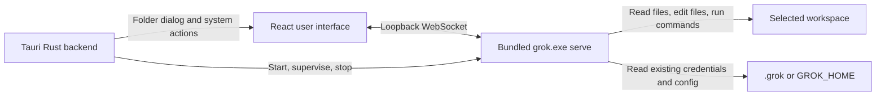

# Grok Tauri Desktop Implementation Plan

> **For agentic workers:** REQUIRED SUB-SKILL: Use superpowers:subagent-driven-development (recommended) or superpowers:executing-plans to implement this plan task-by-task. Steps use checkbox (`- [ ]`) syntax for tracking.

**Goal:** Build a Windows desktop application with React and Tauri that provides a graphical interface for the existing Grok Build agent without adding an application login flow.

**Architecture:** Create a separate Tauri 2 application rather than embedding the existing Ratatui terminal UI. The Tauri backend starts a bundled `grok.exe` in `serve` mode on a loopback port with a per-launch secret; the React UI communicates with that process over WebSocket. The existing agent remains responsible for model requests, file operations, shell execution, configuration, and workspace behavior.

**Tech Stack:** React 18, TypeScript, Vite, Tauri 2, Rust, WebSocket, Windows NSIS installer.

---

## Scope and Non-Goals

- The desktop app has no account system, login page, or credential-entry UI.
- Existing credentials continue to come from `%USERPROFILE%\\.grok`, a `GROK_HOME` override, or approved environment variables.
- The first release targets Windows x64 only.
- The existing CLI/TUI source remains unmodified unless a verified protocol gap requires a small upstream-facing adapter.
- Do not embed the Ratatui UI in a terminal emulator. Recreate required user workflows as native React views.

## Target Architecture



## Proposed Project Structure

Create the desktop app in a separate sibling repository or directory, such as `D:\\mx\\grok-desktop`. Do not add Node or Tauri build artifacts to this periodically synced Rust workspace.

```text
grok-desktop/
  package.json
  vite.config.ts
  src/
    app/
      App.tsx
      routes.tsx
    components/
      WorkspacePicker.tsx
      ChatPanel.tsx
      ActivityPanel.tsx
      FileChangeCard.tsx
      RuntimeStatus.tsx
    lib/
      agentClient.ts
      protocol.ts
      runtime.ts
    stores/
      agentStore.ts
      workspaceStore.ts
  src-tauri/
    Cargo.toml
    tauri.conf.json
    capabilities/default.json
    resources/grok.exe
    src/
      lib.rs
      main.rs
      commands.rs
      runtime.rs
      process.rs
      error.rs
  scripts/
    copy-grok-binary.ps1
```

## Milestone 0: Verify the Agent Service Contract

**Purpose:** Establish the exact `grok serve` command, health/ready signal, WebSocket URL, authentication parameter, request schema, event schema, and shutdown behavior before implementing UI code.

- [ ] Build a release candidate of the existing agent with `cargo build -p xai-grok-pager-bin --release`.
- [ ] Identify the exact `serve` CLI arguments from `crates/codegen/xai-grok-pager-bin/src/main.rs` and the associated command definitions in `crates/codegen/xai-grok-pager/src/app/`.
- [ ] Launch the binary on `127.0.0.1` with a fixed test port and a temporary test secret.
- [ ] Record the ready condition, expected WebSocket path, query/header used for the service key, request messages, response events, reconnect behavior, and shutdown signal.
- [ ] Build a minimal local WebSocket probe that sends one harmless prompt against a disposable workspace.
- [ ] Record the resulting protocol in `docs/agent-service-protocol.md` in the new desktop project.
- [ ] If `serve` cannot create and stream a normal coding-agent session, stop UI work and design a small Rust adapter around the supported `stdio`/ACP mode instead.

**Acceptance criteria:** A documented, repeatable service invocation sends a prompt, streams at least one response event, and exits without leaving a process behind.

## Milestone 1: Bootstrap the Desktop Shell

**Purpose:** Create a distributable Tauri project that starts and stops the bundled agent safely.

- [ ] Initialize a Tauri 2 React + TypeScript + Vite project in the separate `grok-desktop` directory.
- [ ] Copy the Windows release binary to `src-tauri/resources/grok.exe` via `scripts/copy-grok-binary.ps1`; the script must fail if the source binary does not exist.
- [ ] Configure `src-tauri/tauri.conf.json` for Windows x64, NSIS output, WebView2 bootstrapper, application icon, and `grok.exe` as a bundled resource.
- [ ] Implement `runtime.rs` with a `ManagedAgent` state object containing the child process handle, loopback address, service secret, startup status, and last error.
- [ ] Implement a free-loopback-port function that binds `TcpListener` to `127.0.0.1:0`, reads the assigned port, releases the listener, then starts the child immediately.
- [ ] Generate a cryptographically random per-launch service secret; never write it to frontend logs, browser console output, or persistent storage.
- [ ] Start the child process using the resolved Tauri resource path and the verified arguments from Milestone 0.
- [ ] Implement bounded readiness polling; return a structured startup error after the chosen timeout with the child stderr location.
- [ ] Implement application-exit cleanup that requests shutdown, waits briefly, then terminates the child process tree if it remains alive.

**Acceptance criteria:** Launching the desktop shell starts one agent process; closing the app removes that agent process; a failed launch provides an actionable error instead of a blank window.

## Milestone 2: Restrict Native Capabilities and Define Tauri Commands

**Purpose:** Expose only the native operations the UI needs and keep the WebView from receiving broad filesystem or shell rights.

- [ ] Configure `src-tauri/capabilities/default.json` with dialog permission for folder selection and only the shell/process permissions required for the bundled sidecar.
- [ ] Do not grant direct arbitrary filesystem read/write capabilities to the WebView.
- [ ] Do not grant a generic arbitrary-command execution capability to the WebView.
- [ ] Add `select_workspace() -> Result<Option<String>, AppError>` using Tauri's native folder dialog.
- [ ] Add `start_agent(workspace_path: String) -> Result<RuntimeConnection, AppError>` that validates the selected path exists and is a directory before launching or reusing the runtime.
- [ ] Add `stop_agent() -> Result<(), AppError>` that closes the active runtime.
- [ ] Add `get_runtime_status() -> RuntimeStatus` returning `stopped`, `starting`, `ready`, or `failed` plus a user-safe message.
- [ ] Add `open_path(path: String) -> Result<(), AppError>` that canonicalizes the requested path and rejects paths outside the selected workspace before opening Explorer.
- [ ] Serialize all command responses with explicit, stable fields so TypeScript can model them without `any`.

**Acceptance criteria:** The React app can select a folder, start/stop the agent, display status, and open only files inside the selected workspace.

## Milestone 3: Implement the WebSocket Client Boundary

**Purpose:** Keep protocol details out of React components and provide a typed event stream to application state.

- [ ] Create `src/lib/protocol.ts` with TypeScript discriminated unions for the verified request and event types from Milestone 0.
- [ ] Create `src/lib/agentClient.ts` as the single component that opens the loopback WebSocket, appends the short-lived service secret, serializes requests, parses messages, and surfaces close/error events.
- [ ] Reject messages that do not match a supported event shape and show a protocol error without crashing the UI.
- [ ] Implement `connect(connection: RuntimeConnection)`, `sendPrompt(prompt: string)`, `cancel(taskId: string)`, and `disconnect()` functions.
- [ ] Implement one reconnect attempt only when the desktop runtime reports `ready`; do not reconnect endlessly after a runtime failure.
- [ ] Create `src/stores/agentStore.ts` with explicit state for connection status, conversation messages, current streaming message, tool activities, file changes, active task ID, and last error.
- [ ] Route all parsed protocol events through store actions; React components read state but do not parse raw WebSocket messages.

**Acceptance criteria:** A local protocol fixture test verifies parsing of text streaming, tool activity, file changes, completion, cancellation, and malformed input.

## Milestone 4: Build the First Usable Interface

**Purpose:** Deliver the smallest graphical workflow that replaces the primary TUI interaction.

- [ ] Implement `WorkspacePicker.tsx` with a folder-selection action, selected path display, and disabled start button when no folder is selected.
- [ ] Implement `RuntimeStatus.tsx` with clear states for stopped, starting, connected, disconnected, and failed. Never expose the WebSocket secret.
- [ ] Implement `ChatPanel.tsx` with a scrollable message history, multiline prompt input, submit action, keyboard shortcut, streaming indicator, and stop button.
- [ ] Render model responses with Markdown and escaped code blocks; avoid raw HTML rendering from agent output.
- [ ] Disable prompt submission while the runtime is starting, stopped, or failed; preserve unsent text if a connection attempt fails.
- [ ] Implement `ActivityPanel.tsx` to show tool name, status, command/output summary, and error status in chronological order.
- [ ] Implement `FileChangeCard.tsx` to show create/update/delete metadata and an `Open in Explorer` action routed through `open_path`.
- [ ] Show a stable empty state explaining that the app has no built-in login and uses existing local Grok/API credentials.

**Acceptance criteria:** A user can select a workspace, begin a conversation, see streamed output, see tool activity and file changes, cancel an active task, and start another prompt.

## Milestone 5: Configuration, Diagnostics, and Failure Handling

**Purpose:** Make a local-only application debuggable without collecting credentials or adding a login system.

- [ ] Add a settings/diagnostics view that displays selected workspace, runtime status, app version, bundled agent version, log directory, and active configuration source (`default .grok` or `GROK_HOME`), without displaying secret values.
- [ ] Detect missing usable credentials only through the agent's verified error/status response; never scan environment variables and never transmit their values to the WebView.
- [ ] Present a clear message when credentials are unavailable: configure the existing Grok/API credentials locally, then restart the agent.
- [ ] Capture child stdout/stderr into rotating local log files under Tauri's app log directory, excluding the launch secret from recorded command lines.
- [ ] Add a `Copy diagnostic summary` action containing versions, status, sanitized failure text, and log location.
- [ ] On child-process exit, update the runtime state, disconnect the WebSocket, preserve chat history in memory, and offer an explicit restart action.

**Acceptance criteria:** Missing configuration, startup failure, unexpected child exit, WebSocket disconnect, and invalid workspace all result in human-readable recovery guidance.

## Milestone 6: Build, Package, and Validate Windows Installation

**Purpose:** Produce a Windows installer that works on a clean machine without Rust, Node.js, or Git installed.

- [ ] Add `npm run build:agent` to build `xai-grok-pager-bin` in release mode or validate an externally supplied approved binary.
- [ ] Add `npm run sync:agent` to copy and checksum the approved `grok.exe` into Tauri resources.
- [ ] Add `npm run build` to build the React frontend and run `tauri build`.
- [ ] Configure a stable Windows application identifier, product name, version source, icon set, and NSIS installer settings.
- [ ] Verify the packaged application resolves `grok.exe` through Tauri's resource API rather than a development-relative path.
- [ ] Test installation and launch on a clean Windows VM or test account with WebView2 absent and present.
- [ ] Test behavior when the bundled agent cannot start, when the selected folder is inaccessible, and when no local credentials exist.
- [ ] Test app shutdown and verify no `grok.exe` process remains.
- [ ] Produce a release checklist including license distribution: Apache-2.0 license, `THIRD-PARTY-NOTICES`, and applicable NOTICE files must be included with the installer or in an accessible About/Licenses view.

**Acceptance criteria:** The NSIS installer installs, launches, starts the bundled service, and uninstalls cleanly on Windows x64 without developer tooling.

## Test Strategy

- Rust unit tests: port selection, secret generation, workspace-path containment, process lifecycle state transitions, structured errors.
- TypeScript unit tests: protocol parsing, store reductions, reconnect rules, Markdown rendering safety.
- Tauri integration tests: folder selection command boundaries, runtime launch error handling, process cleanup.
- Manual smoke test: prompt streaming, tool execution display, file-change card, cancellation, restart, and shutdown.
- Packaging smoke test: installation on a clean Windows environment with no Rust/Node/Git.

## Delivery Order

1. Validate `serve` protocol end-to-end before creating final UI abstractions.
2. Deliver Tauri process supervision with a status-only screen.
3. Add typed WebSocket streaming and a single chat session.
4. Add tool activity, file changes, diagnostics, and restart behavior.
5. Produce the Windows installer and complete clean-machine validation.

## Risks and Decisions

- **Protocol suitability:** The `serve` mode must support normal coding-agent sessions and streaming. If it does not, use the documented `stdio`/ACP entry point behind a local Rust adapter rather than coupling React to TUI internals.
- **Windows build support:** The source repository describes Windows source builds as best-effort. Treat a reproducible approved `grok.exe` build as a release prerequisite.
- **Process security:** Bind only to loopback and use a per-launch service secret. Never expose that secret to logs or persist it.
- **Credential model:** No desktop login means no credential onboarding. Users must have preconfigured local credentials or an approved environment-based setup.
- **Upstream maintenance:** Keep desktop-specific code in its own project so updates to the synced Rust source are easier to absorb.
